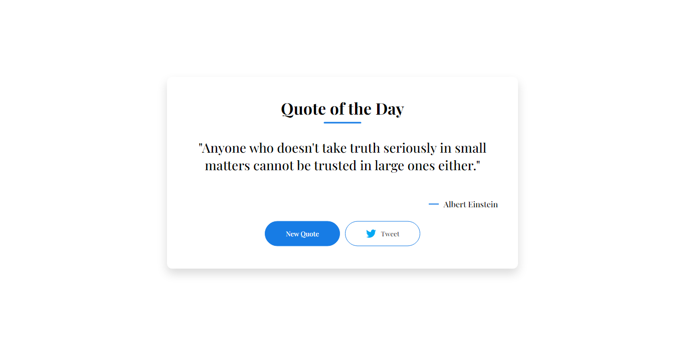

# Daily Quote App #

## Overview ##

The Daily Quote App is a simple web application that provides users with a daily dose of inspiration through random quotes sourced from an online API. The app displays the quotes on a clean and minimalistic HTML card, enhanced with JavaScript functionalities and styled using CSS.

## Features ##
* **Random Quotes**: Fetches a random quote from an online API to provide users with fresh and diverse content every day.
* **Responsive Design**: Ensures a seamless user experience on various devices with a responsive and user-friendly interface.
* **Simple Card Layout**: Presents quotes in a simple card layout, making it easy for users to read and share their favorite quotes.
* **Easy to Use**: Minimalistic design and intuitive navigation make the app accessible to users of all levels.

## Technologies Used ## 
* **HTML5**: Markup language for structuring the content.
* **CSS3**: Stylesheet language for styling the app.
* **JavaScript**: Programming language for enhancing interactivity and fetching quotes.
* **Quotable**: API used to retrieve random quotes.

## Getting Started ##
1. **Clone the repository**: git clone https://github.com/keddo/Js_Mini_Projects.git
2. Open Daily-Quotes/index.html in your preferred web browser.

## Usage ##
Visit the app daily to get a new inspiring quote.
Share your favorite quotes on twitter directly from the app.

## Acknowledgments ##
Special thanks to Quotable for providing the quote API.